### [View all Roadmaps](https://github.com/nholuongut/all-roadmaps) &nbsp;&middot;&nbsp; [Best Practices](https://github.com/nholuongut/all-roadmaps/blob/main/public/best-practices/) &nbsp;&middot;&nbsp; [Questions](https://www.linkedin.com/in/nholuong/)
 

Github Actions has emerged as a powerhouse for CI/CD workflows in recent years and is also one of the top choices for software developers looking for free options.

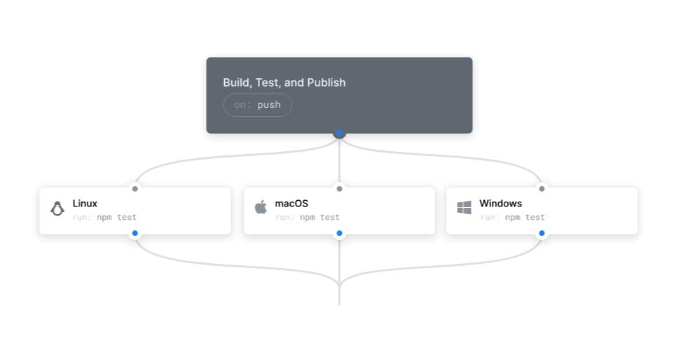

Reference source: https://github.com/features/actions

In this article, Dr.JOY will introduce you to how to deploy CI/CD with Github Action to reduce costs. In which, you can use Github Action to deploy CI/CD for Android and iOS, replacing other CI/CD services such as: CircleCI, Travis, ...

We have 2 server options:

Provided by Github
Use a personal computer or private server

First, Dr.JOY will introduce you to how to use the server provided by Github first.

Step 1: To do that, you need to Enable Actions in your repository
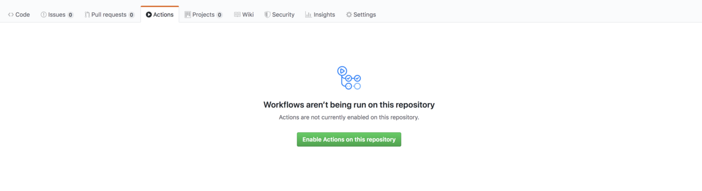

Before we get into the practice. You can get a little familiar with the workflow concept HERE: https://docs.github.com/en/actions/writing-workflows/workflow-syntax-for-github-actions

Step 2: Create a new Workflows
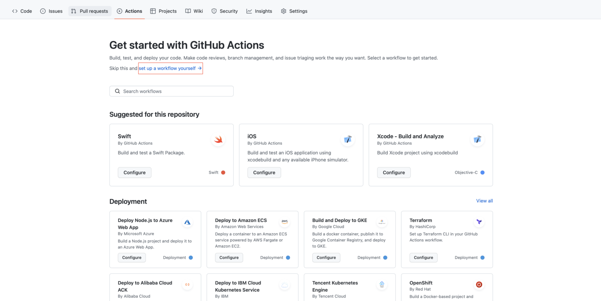

Step 3: Choose workflow type, here I build for iOS so I will choose iOS
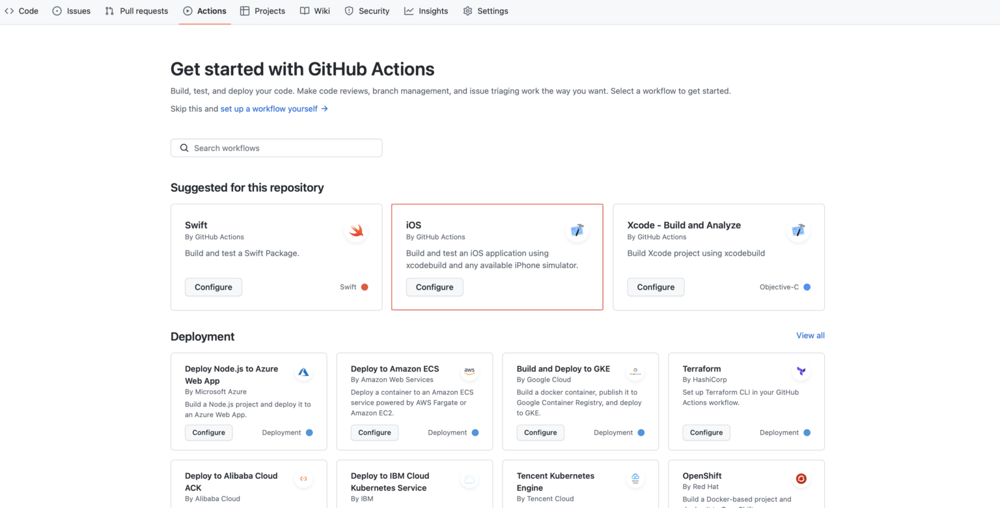

Github will create a sample workflow for iOS for us.
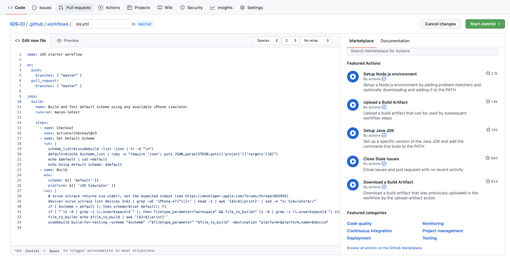

Introducing the current workflow including:

push and pull_requests: master
– Every time we commit or create a pull request to the master branch, a trigger will be created to run this workflow.

runs-on: macos-latest
– We choose the github server macos-latest to perform the build for iOS.

steps:
– Including execution commands.

name: Checkout
– The command to checkout the source code according to the current commit.

name: Build
– Execute the iOS build according to the default scheme.

You click Start Commit to add that workflow to the project.

At this time, the project will have an additional workflows folder created.

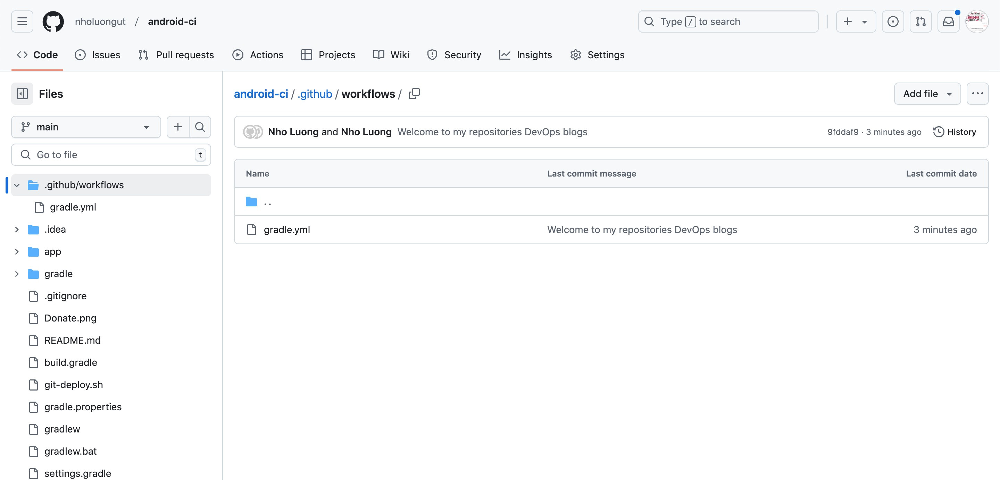

This is the folder that contains our workflows.
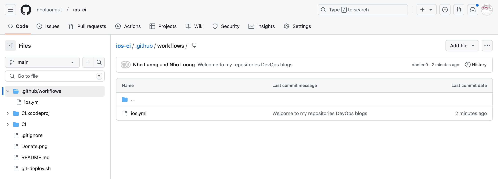
We click on the Actions section to see the list of workflows.
Every time we commit or create a pull request to the branch with the workflow installed, a workflow will be run.
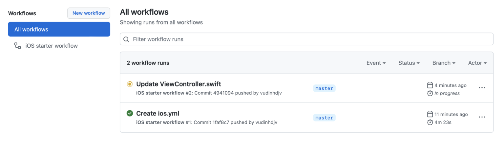

Result:

You will see a list of current workflows along with information about build time, build result
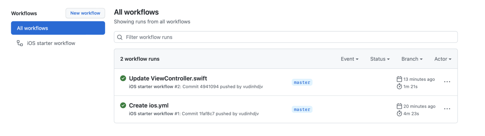

Click inside and you will see the running steps and the running time of each step.

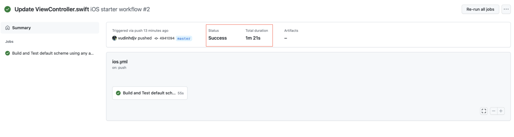

See details of each step
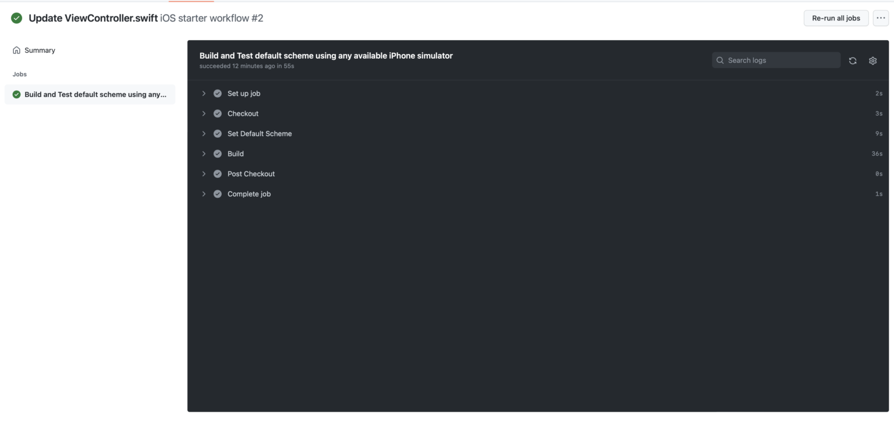

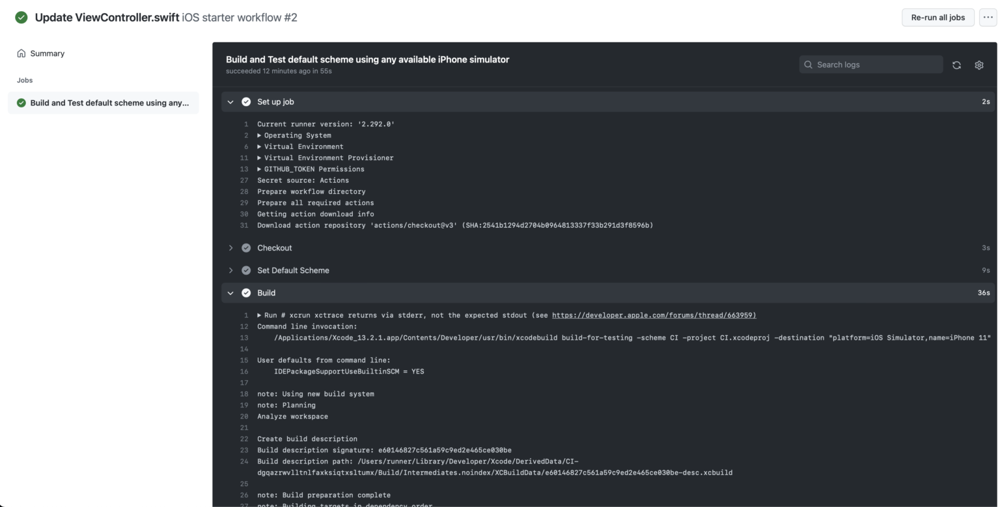
In this article, I will only introduce how to deploy a simple CI. To be able to build and deploy an iOS application to TestFlight or Firebase Distribution, we will use fastlane. For Android, we can use Docker and deploy the app to Google Play or Firebase Distribution. Please look forward to the next articles.

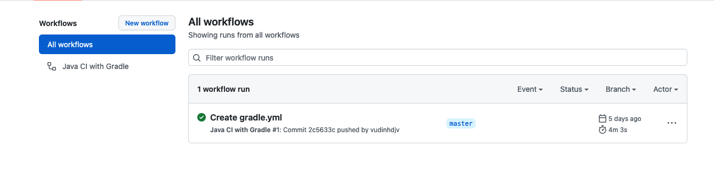
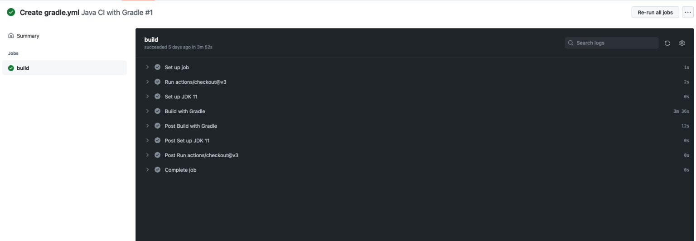

## Repositories
#### Reference source: : https://github.com/nholuongut/android-ci
#### Reference source: : https://github.com/nholuongut/ios-ci

## 🚀 I'm are always open to your feedback🇻🇳🇻🇳🇻🇳🇻🇳🇻🇳🇻🇳🇻🇳🇻🇳🇻🇳🇻🇳🇻🇳🇻🇳🇻🇳🇻🇳🇻🇳🇻🇳

# **[Contact Me🇻🇳🇻🇳🇻🇳🇻🇳🇻🇳🇻🇳🇻🇳]**
* [Name: Nho Luong]
* [Skype](luongutnho_skype)
* [Github](https://github.com/nholuongut/)
* [Linkedin](https://www.linkedin.com/in/nholuong/)
* [Email Address](luongutnho@hotmail.com)
* [PayPal.Me](https://www.paypal.com/paypalme/nholuongut)

# License🇻🇳🇻🇳🇻🇳🇻🇳🇻🇳🇻🇳🇻🇳🇻🇳
* Nho Luong (c). All Rights Reserved.🌟
